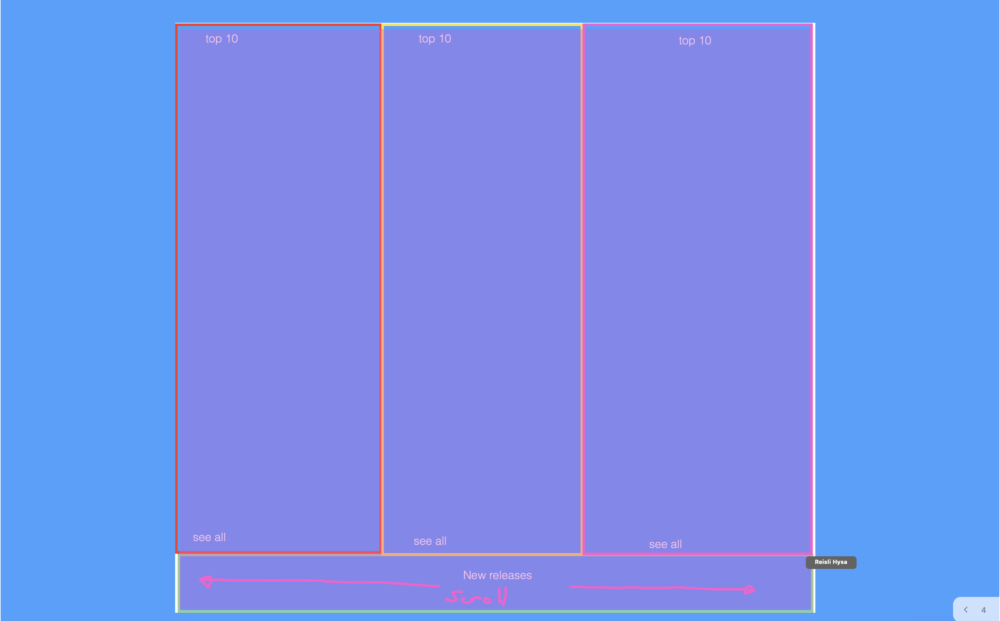

# Project 2 - Napster

## Table of Contents

- Brief
- Project Overview
- Technologies Used
- Approach Taken
- Finished Product
- Bugs
- Challenges and Wins
- Future Features and Improvements
- Key Learnings

---


## Brief

- Use an external API.
- Have several components.
- Use a router - allowing for the app to have several pages.
- Wireframes.
- Be deployed online.

## Project Overview

Napster is an app where we used Napster’s API to showcase the top artists, tracks and albums in the UK. It is also somewhere where you can search for trending music by particular genre and you can search for any artist you like. This was a 48 hour hackathon pair coded project and was my first experience using React and a public API.

Find the deployed version here:

## Team Members

- Reisli Hysa: https://github.com/ReiHysa

## Technologies Used

- React
- CSS
- JSX
- Axios
- React Router Dom

API used: https://api.napster.com/

Dev Tools:

- GitHub
- Postman
- Yarn
- VS Code
- Netlify
- Git

## Approach Taken

**Planning and Preparation:**

Given that we only had two days to build this project Reisli and I had to put all our ideas for the project together quickly. Once we had decided to use the Napster API to create a music app we tested out the API on Postman and made some basic requests, to ensure we were getting back the data we needed.

Once we decided on exactly what we wanted to be in the app we made some basic wireframes just to outline the structure of our pages. Here are a couple examples of the wireframes we made:

**_Homepage Wireframe_**


**_Trending Wireframe_**



Once we were happy with our API and the structure of each page we moved on to working on the front-end. As this was a pair coded project, we decided to use VS Code’s live share extension which allowed us to work together at the same time and also delegate work individually in places.

### Trending

In order to keep our code clean and to avoid making multiple requests on different components we made a helpers api file where we exported the different types of requests so we could use them anywhere. To begin with I used console.logs when making requests in order to visually see the response we were getting back before I showcased it on the front-end.

For the Trending page, it involved making around three different requests and displaying them all on the same page. For instance:

```
const Trending = () => {
    const [topArtists, setTopArtists] = useState([])
    const [topTracks, setTopTracks] = useState([])
    const [topAlbums, setTopAlbums] = useState([])

    useEffect(() => {
        fetchTopArtists().then(setTopArtists)
        fetchTopTracks().then(setTopTracks)
        fetchTopAlbums().then(setTopAlbums)
    }, [])


    return (
        <div className='backer'>

        <div className='Trending'>
            <div className='headers'>
            <h1>Top 10 Artists</h1>
            <h1>Top 10 Tracks</h1>
            <h1>Top 10 Albums</h1>
            </div>
            <div className='top-artists'>
                {topArtists.map((artist) => (
                    <TopArtistCard {...artist}/>
                ))}
            </div>
            <div className='top-tracks'>
                {topTracks.map((track) => (
                    <TopTrackCard {...track} />
                ))}
            </div>
            <div className='top-albums'>
                {topAlbums.map((album) => (
                    <TopAlbumCard {...album} />
                ))}
            </div>
        </div>
        </div>
    )
}

```

As you can see here we made three requests to get the top 10 tracks, artists and albums and stored the response’s data in state. We then mapped each of the state variables into different components.

### Genre

For the genre page it was slightly more complicated, as we first had each type of genre showcased on a page for the user to choose which one they wanted to browse. Then after clicking on that particular genre we had to fetch the top albums, tracks, artists and new releases according to the particular genre's id.

```

export const fetchGenreTopTracks = async (id) => {
    const config = {
        method: 'get',
        url: `${basicUrl}/genres/${id}/tracks/top?limit=10`,
        headers: {
                  'apikey': 'NWNmNzlhMDMtMGUzYi00OGJiLTg0YTUtMTRhOTcwNTcxMjJj',
                  'Cookie': 'ak_bmsc=347C9925790D742241A03CC1115C677F~000000000000000000000000000000~YAAQ3zEUAh7ufLZ8AQAAPun5vA0eRQODUDyaKM/ViWs/bQqE+GHtLWf7uMcv8RmAFrvk8OKNfuebSCyq3ysM/lkIutKz8OZiLIfe0tABq0MBxa5WTCnd7XN85p0c7yds3KbqhpHS84ns+DBr4hY3lp93N3x9eQAQamYmYct2qxDScNVIZaRP8ZQJMUXJqj1s0mysfSvjyr020OAJaPU/4DSm2o54P6dz30uo5GqA008llDVcK8MpungEZv2vmf0XJHt96BP1SlRVNv17fTA2i/4PjSpy3NYnP0UN1pr3Ig0hCKI170fZBVuPa4uEtmGFAObrRsPQl9dPAjInr1iK9Ex62s5t+hfHMMxLg9yduZmPFmGJv3ZWgqkGtA==',
        },

    }
    const response = await axios(config)
    return response.data.tracks
}

```

```

const [genreTracks, setGenreTracks] = useState([])

    useEffect(() => {
        fetchGenreTopTracks(id).then(setGenreTracks)
    },[] )

```

Here I passed the id of the genre selected by the user into the request using useParams() and then I stored the response’s data into the state variables. Which is then mapped into different components to be displayed on the front end.

### Search Barß

Another addition made was adding some functionality where you could search for an artist. The Napster API provided documentation on how to query for artists, so as you can see below I set the variable of search to the users input and then passed that into the request called fetchSearch when the form was submitted and then set the response to another state variable that I later displayed on the front-end.

```

  const [search, setSearch] = useState('')
  const [searchList, setSearchList] = useState([])

  const handleChange = (event) => {
    setSearch(event.target.value)
  }

  const handleSubmit = (event) => {
    event.preventDefault()

    fetchSearch(search).then(setSearchList)
  }

```

```

  <form method="GET" onSubmit={handleSubmit}>
            <input type='search' placeholder='Search for your favorite artist..' value={search} onChange={handleChange} id='text-search'></input>
            <input type='submit' id='submit-search' value="GO" />
  </form>

```

### Styling

Once we were happy with the structure of our pages and the functionality of the app we began to style. We used CSS to style all our pages and made different files for each page to ensure we didn’t have too much code in one file.

We were both incredibly happy with the final product given it was not only our first time using React but also what we managed to achieve in 48 hours. I found that wireframing and planning how we wanted the app to look before we started really helped us work together well and ensured we both shared the same vision. I also found that making the helpers API page at the start was incredibly useful and saved us both a lot of time when coding.

## Finished Product

Add later.

## Bugs

- There is a slight delay when loading the top artists and their single pages.
- Some of the descriptions for the single artists contain code within them - this was something to do with Napster’s API which we failed to get round to resolving.

## Wins and Challenges

**_Wins_**

- Overall I was very happy with the styling of the app, I think we managed to achieve a really professional looking theme, especially on the home page.
- We were both really happy that we managed to get around to adding search functionality as this was a stretch goal.
- This was my first experience working on a project with someone else and I thoroughly enjoyed it and learnt a lot on how to work as a team.

**_Challenges_**

- One of the main blockers I had during the project was with the images in Napster’s API. In their data they had an API within the request which led to us having to make multiple requests when fetching images and displaying them on the front-end. This took some time to figure out and was a bit of a challenge, but by speaking through it together as a team we overcame this small issue.

## Future Content and Improvements

- Including mobile CSS styling additions.
- Adding artists tracks and albums on their single pages.
- Fixing the above bugs.

## Key Learnings

I found that I really learnt how to work as a team during this project. Given the short amount of time we had we both really had to plan and work together to get everything finished in time. Also as it was my first ever project using React it really helped consolidate everything I had learnt in lessons and how to work with a public API in that scenario.
